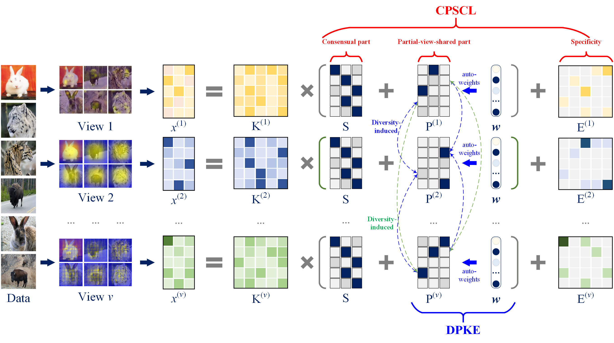
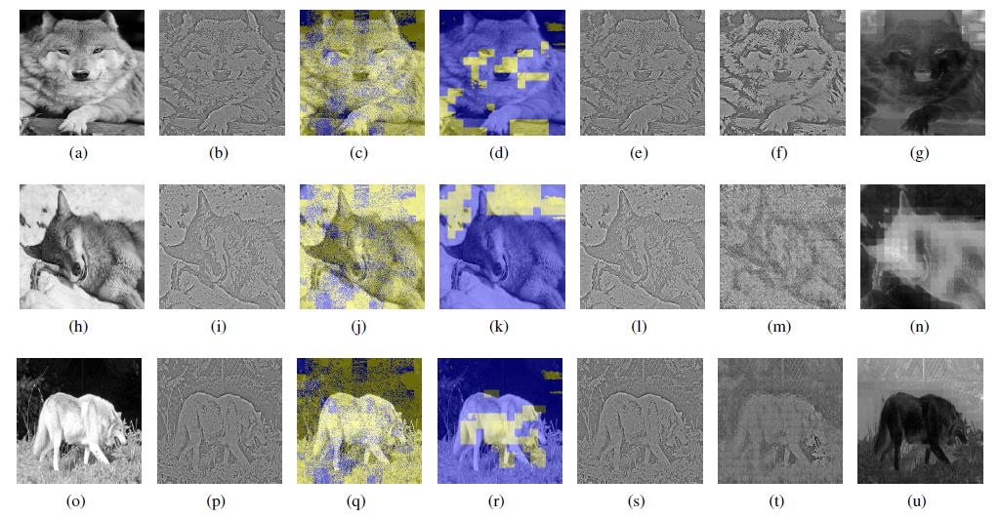

# CDPMVL: Consensus and Diversity-fusion Partial-view-shared Multi-view Learning

## Introduction

CDPMVL is an algorithm that partitions data into three parts: (a) consensual part; (b) partial-view-shared part; and (c) specific part. It learns consensus and partial-view-shared knowledge for clustering. Some visualisation results on YALE are as follows (please refer to ```./visualization/``` for more)



## Example usage

- Use ```addpath('./utils/');``` and ```addpath(genpath('./utils/'))``` to add the required auxiliary functions, after which you can use ``` CDPMVL(fea, gt, options)```to call CDPMVL wherever you need to.

- You can launch the program by executing "demo_YALE.m" in the root directory (in windows) on ```Matlab```

```python
demo_YALE.m
```

- or use the following command to run it in Linux (The output will be stored in "fill.out"). The codes will be run directly without errors.

```Cpython
nohup matlab <demo_YALE.m> fill.out &
```

## Example of drawing attention



Folder ```attention_example``` provides an example to draw the attention map for input images. The following code should generate the image without error, and you can find the images in the folder ```./attention_example/plot/```

```python
# Switch to folder
cd ./attention_example
# run the codes.
matlab draw_attention_example.m
```


## Files

├─ **demo_YALE.m**: A demo that runs CDPMVL on YALE.  
├─ CDPMVL: A series of functions that implement CDPMVL  
├─ utils: A series of auxiliary functions.   
├─ attention_example: A demo that runs the visualization experiments.  
└─visualization: Some experimental results of visualization performed on CDPMVL.  


## Citation

The paper can be accessed via [link](https://authors.elsevier.com/a/1jv7M3INukSKRz), and you can cite it directly:

> L. Y. Teng and Z. F. Zheng, “CDPMVL: Consensus and Diversity-fusion Partial-view-shared Multi-view Learning,” Neurocomputing, 2024, doi: 10.1016/j.neucom.2024.128687

or via `bib`:

> @article{TENG2025128687,
> title = {Consensus and diversity-fusion partial-view-shared multi-view learning},
> journal = {Neurocomputing},
> volume = {611},
> pages = {128687},
> year = {2025},
> issn = {0925-2312},
> doi = {10.1016/j.neucom.2024.128687},
> author = {Luyao Teng and Zefeng Zheng},
> }