# Visualization experiments

The visualization of CDP-MVC on seven datasets. It is worth noting that CDP-MVC converges (or reaches the maximum number of iterations) at the 4nd, 20nd, 14nd, 6nd, 5nd, 20nd, and 8nd iterations on ORL, MSRC_v1, Caltech101-7, Caltech101-20, CiteSeer, NUS_WIDE, Yale, and ALOI_100, respectively.

## ORL (acc = 80.73%)

 | 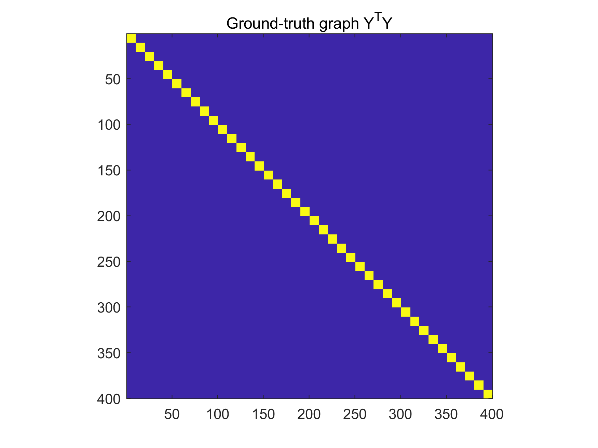 |  |  |
| ------------------------- | ------------------------- | ------------------------- |
 | 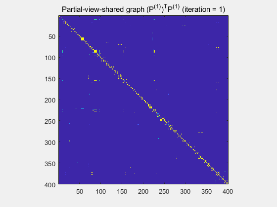 |  |  |

## MSRC_v1 (acc = 88.57%)
 | 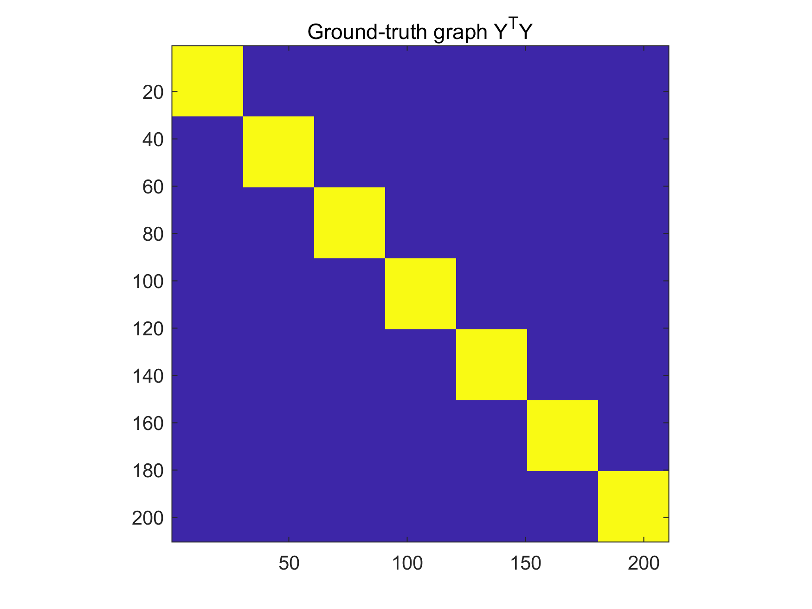 |  |  |
| ------------------------- | ------------------------- | ------------------------- |
 | 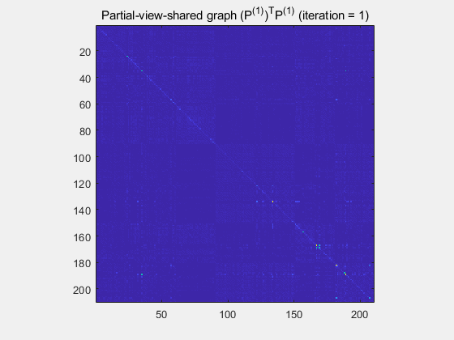 |  | 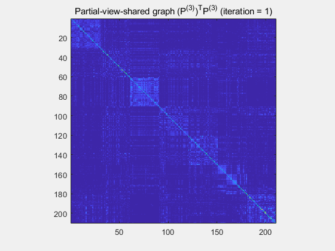 |
 | 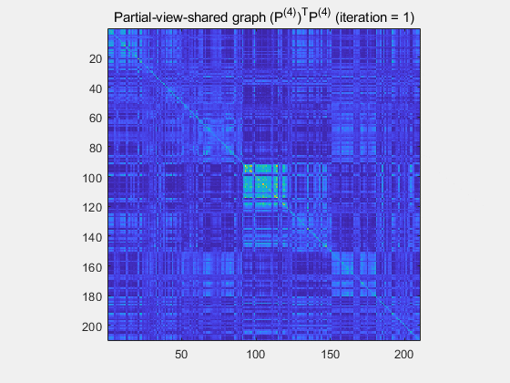 |  |  | 

## Caltech101-20 (acc = 75.23%)
 | 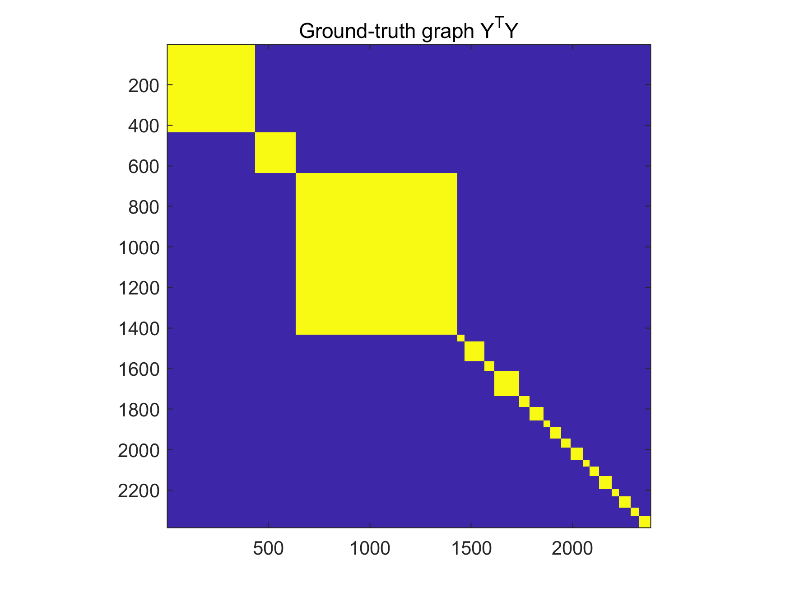 | 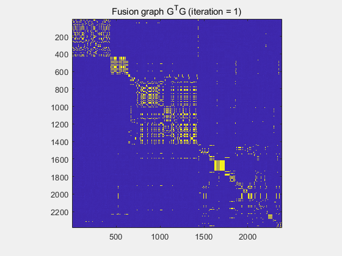 |  |
| ------------------------- | ------------------------- | ------------------------- |
 |  |  |  |
 | 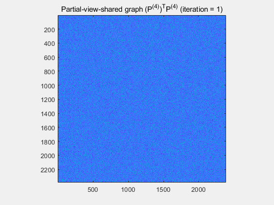 |  | 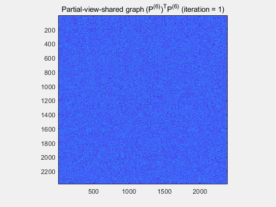 |

## CiteSeer (acc = 56.49%)
 |  |  |  |
| ------------------------- | ------------------------- | ------------------------- |
 |  | 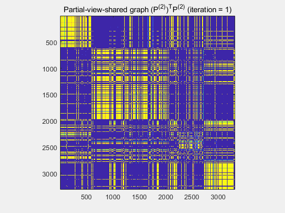 |  | 
## NUS_WIDE (acc = 19.51%)
 | 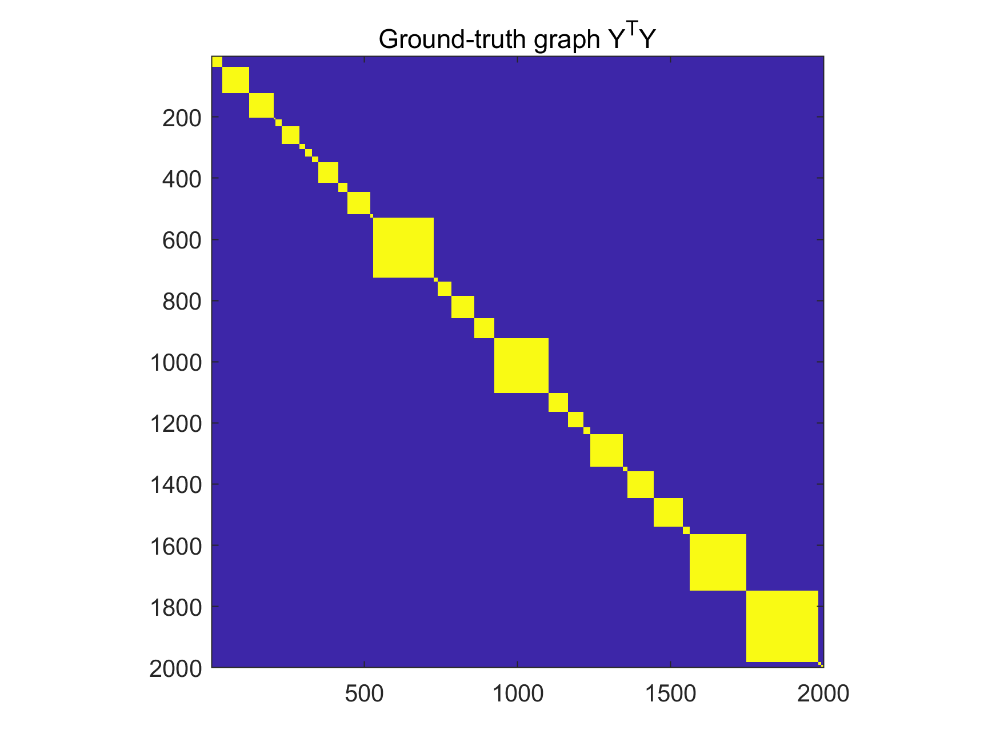 | 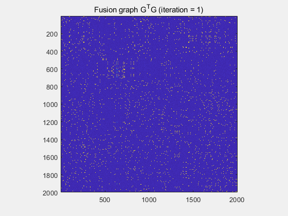 |  |
| ------------------------- | ------------------------- | ------------------------- |
 |  |  |  |
 | 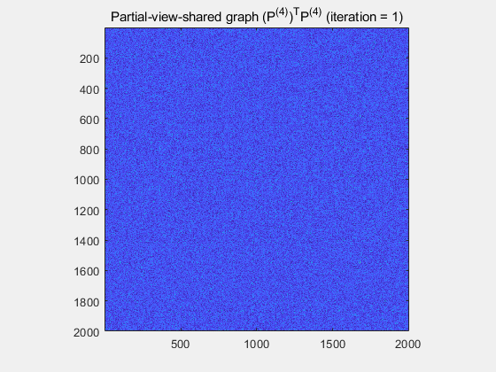 |  |  | 
## Yale (acc = 79.09%)
 |  |  |  |
| ------------------------- | ------------------------- | ------------------------- |
 | 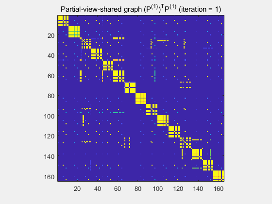 |  | 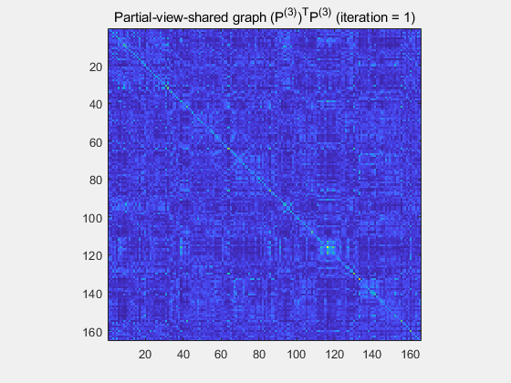 |

## ALOI_100 (acc = 75.51%)
 | 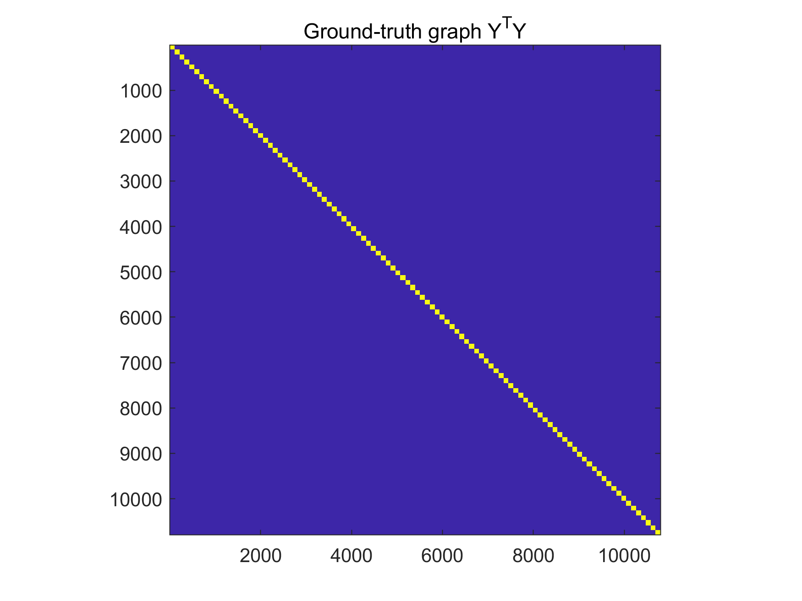 |  |  |
| ------------------------- | ------------------------- | ------------------------- |
 | 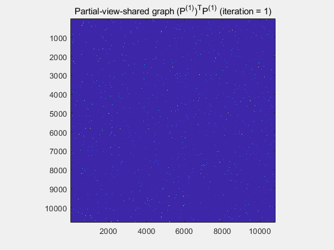 |  | 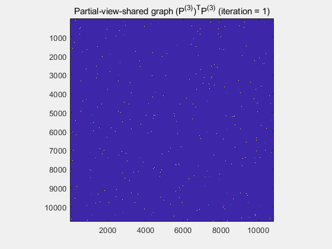 |
 |  |  |  | 